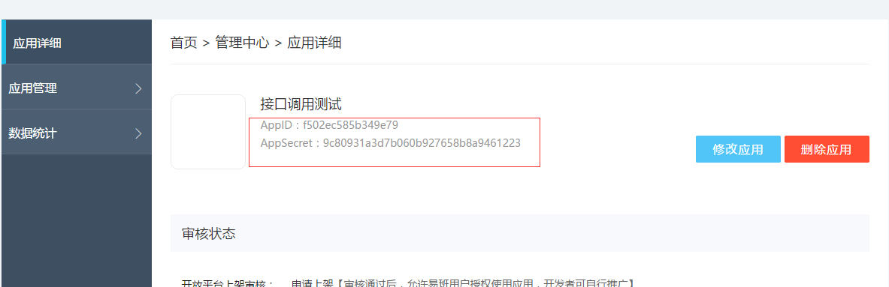
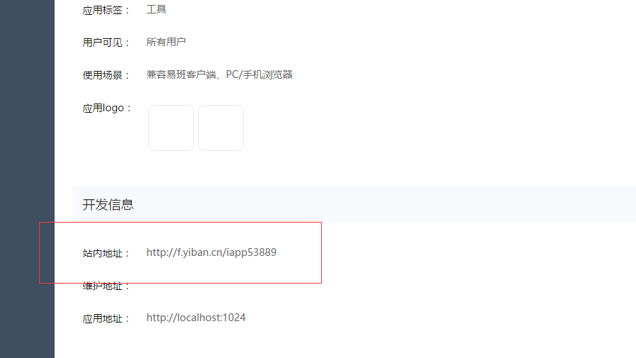

### 易班轻应用开发指南
  
#### 1. 获取应用的基本信息  
访问[易班开放平台](https://o.yiban.cn/)登陆  
如果你还不是开发者请先申请成为开发者。   
点击导航栏的"管理中心"，然后点击左侧的"轻应用",点击右侧的"创建轻应用"，填上必要的信息完成创建。  
进入创建好的轻应用界面，获取AppID、AppSecret（在上侧）、站内地址（在下侧）三个值。
  



#### 2. 引导用户进行授权获取verify_request
引导用户访问   
     
```
 https://openapi.yiban.cn/oauth/authorize?client_id=APPID&redirect_uri=CALLBACK&display=html
```
其中APPID就是上述步骤中的AppID，CALLBACK为上述的站内地址。  
授权成功会重定向到你填的应用地址，并且在url中带参数verify_request，提取这个参数备用。
更具体的步骤详见[轻应用开发](https://o.yiban.cn/wiki/index.php?page=%E8%BD%BB%E5%BA%94%E7%94%A8%E5%BC%80%E5%8F%91%E6%8C%87%E5%8D%97)
    
